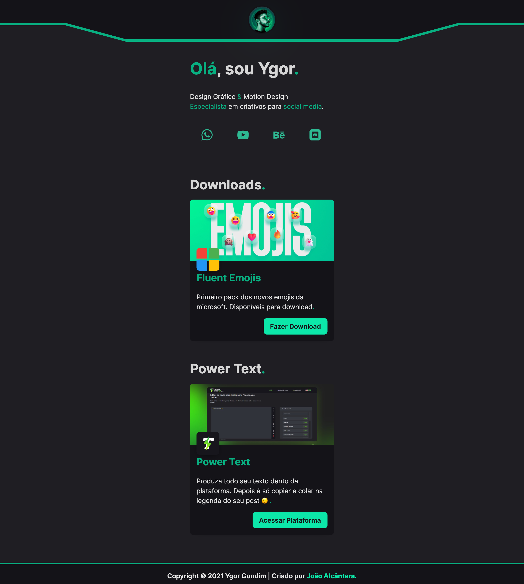

<p align="center">
<!--    -->
</p>

<p align="center">
</p>

<h1 align="center">
    
</h1>

<br>

## 🧪 Technologies

This project was developed with the following technologies:

- [React](https://reactjs.org)
- [TailwindCSS](https://tailwindcss.com/docs/installation)
- [NodeJS](https://nodejs.org/en/)
- [NextJS](https://nextjs.org/)
- More other technologies...

## 🚀 How to run:

Clone the project and access its folder.

```bash
$ git clone https://github.com/joaoalcdev/ygorgondim-links
$ cd ygorgondim-links
```

To start it, follow the steps below:

```bash
# Install the dependencies
$ yarn

# Start the project
$ yarn start or yarn dev
```
The app is available in your browser by address -> http://localhost:3000.

## 💻 Project Desc

[Ygor Gondim | Links](https://ygorgondim-links.vercel.app/) was developed as a proposal for a type of "linktree".

The project was developed by [João Alcântara](https://github.com/joaoalcdev).

## 📝 License

This project is under MIT license. See the file [LICENSE](./LICENSE) for more details.

---

Made with 💜 by [João Alcântara](https://github.com/joaoalcdev) 👋🏻
